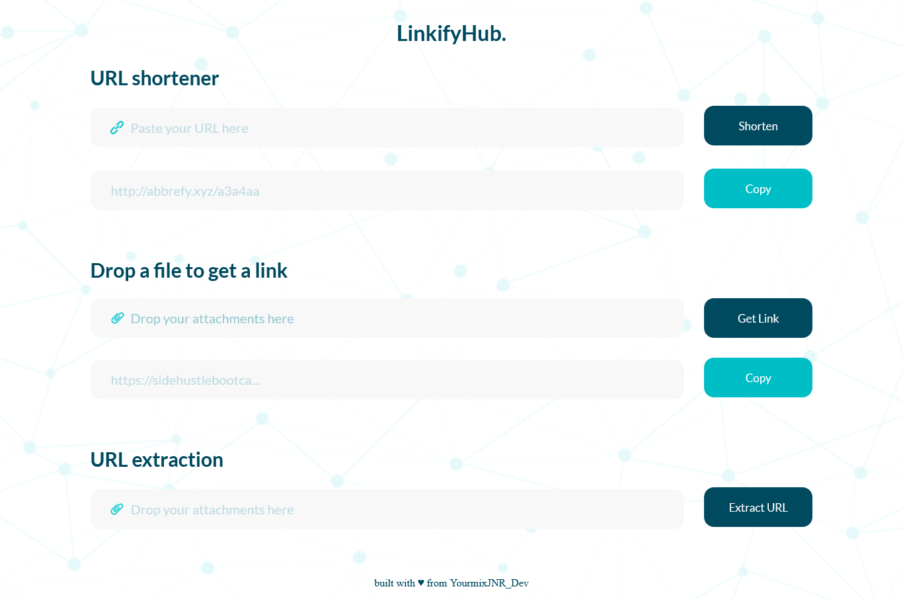
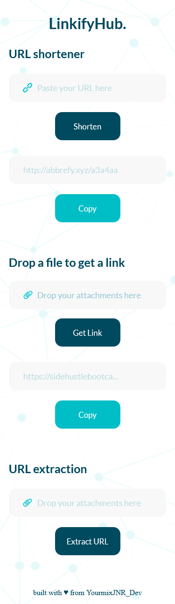

# LinkifyHub

LinkifyHub is a versatile web application that offers the following features:

1. URL Shortener: Easily shorten long URLs to create concise and shareable links.
2. File Uploader: Quickly drop files to generate sharable links for easy sharing and distribution.
3. URL Extractor: Extract all Image \ Video URLs from a webpage. Gather all links in one place.

## Table of contents

- [Overview](#overview)
  - [Screenshots](#screenshots)
  - [Features](#Features)
  - [Technologies Used](#technologies-used)
- [Getting Started](#getting-started)
  - [Usage](#usage)
  - [API Integration](#api-integration)
  - [Continued development](#continued-development)
- [License](#license)
- [Contributing](#contributing)
- [Acknowledgments](#acknowledgments)

## Overview

- Live Site URL: [Live Demo](https://linkifyhub.netlify.app/)
## Screenshots




## Features

- URL Shortener: Create shortened links from long URLs with one click.
- File Uploader: Drag and drop files for instant link generation.
- URL Extractor: Gather all Image \ Video URLs from webpage effortlessly.
- Responsive Design: Enjoy a seamless user experience across various devices.

## Technologies Used

- HTML5
- CSS3
- JavaScript (ES6)
- Fetch API for making API requests.
- Vite

## Getting Started

To run LinkifyHub on your local machine with Vite, follow these steps:

1. Clone this repository to your local machine using `git clone`.

```bash
git clone https://github.com/YourmixJNR/LinkifyHub.git
```
2. Navigate to the project directory.
```
cd linkifyhub
```
3. Install the project's dependencies using npm or yarn.
```bash
npm install
```
  or
```bash
yarn install
```
4. Start the development server.
```bash
npm run dev
```
  or
```bash
yarn dev
```
5. Open your web browser and access the development server at http://localhost:3000.
## Usage

**URL Shortener:**

- Enter a long URL in the input field.
- Click the "Shorten" button to generate a shortened URL.
- The shortened URL will be displayed below the input field.
- Click the "Copy" button to copy the shortened URL to your clipboard.

**File Uploader:**

- Drag and drop a file onto the designated area or click to browse for a file.
- Once the file is uploaded, a sharable link will be generated.
- Click the "Copy" button to copy the link to your clipboard.

**URL Extractor:**

- Enter or paste the webpage URLs into the input field.
- Click the "Extract URLs" button to extract all Image \ Video URLs from the webpage.
- The extracted URLs will be displayed above the input field.

## API Integration

LinkifyHub uses external APIs for URL shortening, File Uploading, URL Extraction. API documentations can be found at:

- URL Shortener API: https://abbrefy.xyz/abbrefy_api
- File Uploader API: https://www.file.io/developers
- URL Extractor API: https://extractorapi.com/docs/

## Continued development

Contributions are highly encouraged! Whether you are a developer, designer, or tester, your help is valuable in making LinkifyHub even better. If you have ideas, bug fixes, or new features to propose, please consider contributing by opening issues or submitting pull requests.

## License

This project is licensed under the [MIT License.](https://opensource.org/licenses/MIT)

## Contributing

Contributions are welcome! If you find any issues or have suggestions for improvements, please open an issue or submit a pull request.

## Acknowledgments

Special thanks to [Abbrefy](https://abbrefy.xyz) for their tool.